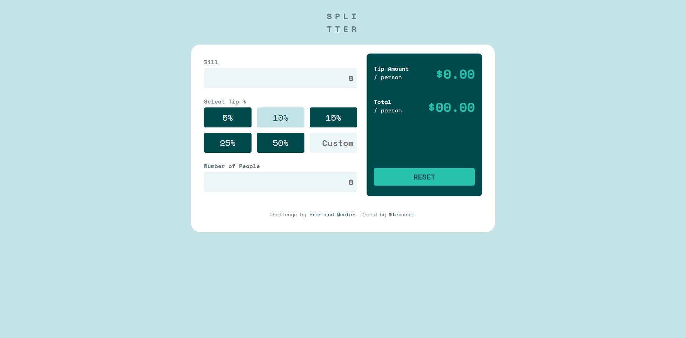
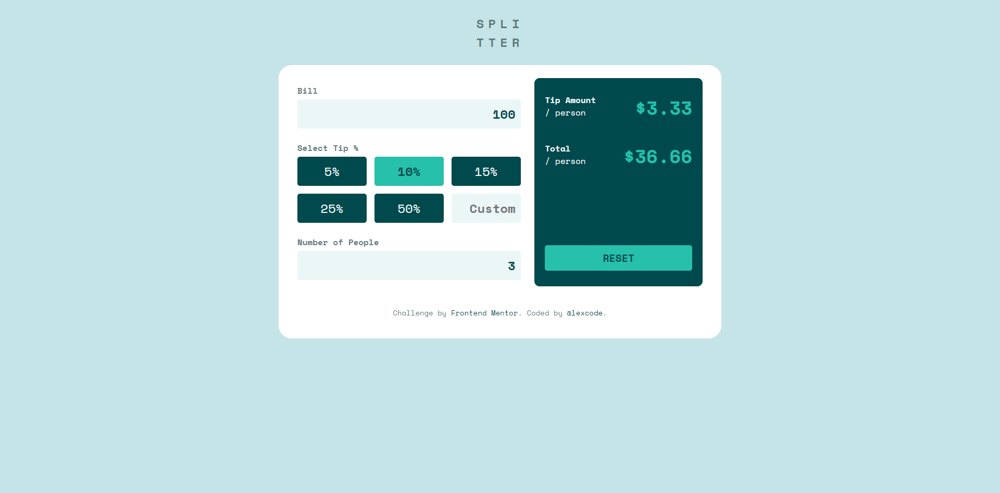

# Frontend Mentor - Tip calculator app solution

This my solution to the [Tip calculator app challenge on Frontend Mentor](https://www.frontendmentor.io/challenges/tip-calculator-app-ugJNGbJUX). Frontend Mentor challenges help me improve my coding skills by building realistic projects.

## Overview

### The challenge

Users should are able to:

- View the optimal layout for the app depending on their device's screen size
- See hover states for all interactive elements on the page
- Calculate the correct tip and total cost of the bill per person

### Screenshot

### Links

- Solution URL: [Repository](https://github.com/lexcode1227/Tip-calculator-app)
- Live Site URL: [Github-pages](https://lexcode1227.github.io/Tip-calculator-app/)

## My process

### Built with

- Semantic HTML5 markup
- CSS custom properties
- Flexbox
- CSS Grid
- Mobile-first workflow
- Javascript

## Author

<!-- - Website - [Add your name here](https://www.your-site.com) -->
- Frontend Mentor - [@henry-1227](https://www.frontendmentor.io/profile/henry-1227)
- Linkedin - [@henry-agustin](https://www.linkedin.com/in/henry-agustin-/)
